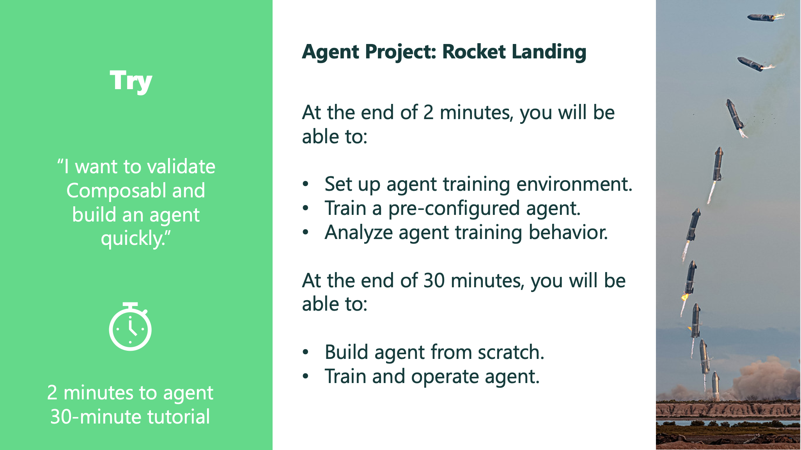

In the try onramp, you will first set up the composabl compute environment on GitHub Codespaces and train your first agent, then you will learn how to build that agent from scratch.

The agent project for this onramp is for the agent to contorl a rocket and land it safely on its tail.

Here is the structure of the project folder for this onramp. The agents folder contains the 2-minute trial, the 30-minute tutorial.

In the project directory are also several other example agents that you can explore on your own after you finish with the tutorial.

```bash
-── rocket_landing
    ├── agents
    │   ├── 2_minute_trial
    │   │   ├── agent.py
    │   │   ├── agent_inference.py
    │   │   └── teacher.py
    │   ├── 30_minute_tutorial
    │   │   ├── agent.py
    │   │   ├── agent_inference.py
    │   │   └── teacher.py
    ├── analytics
    │   └── historian_analytics_rocket_landing.ipynb
    └── sim
```

The analytics folder contains a Python notebook that you will use to analyze the behavior of your rocket landing agents. The sim folder contains the simulation that your agent will use to practice landing rockets.
