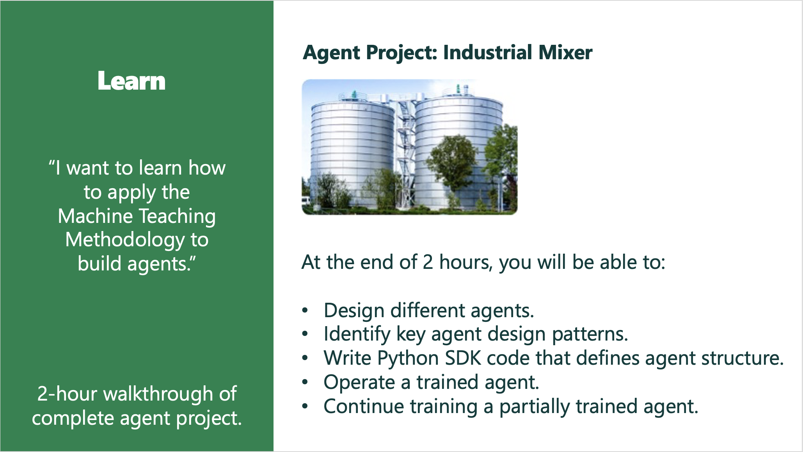

In the learn onramp, learn key machine teaching design patterns by building multiple agents in a 2-hour tutorial.

The agent project for this onramp is for the agent to control an industrial chemcial mixer.

In the project directory are also several other example agents that you can explore on your own after you finish with the tutorial.
