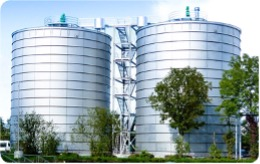
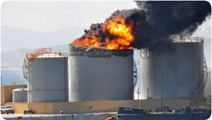
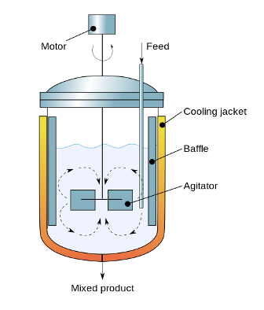
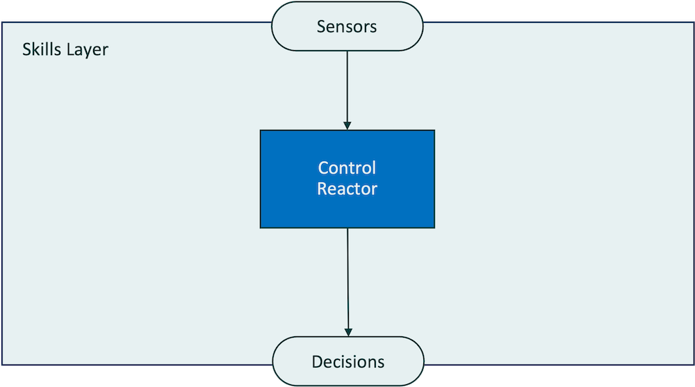
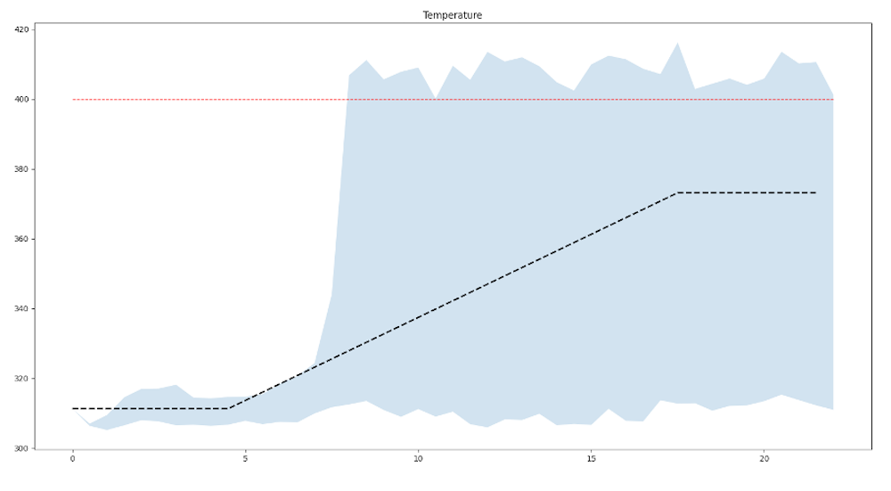
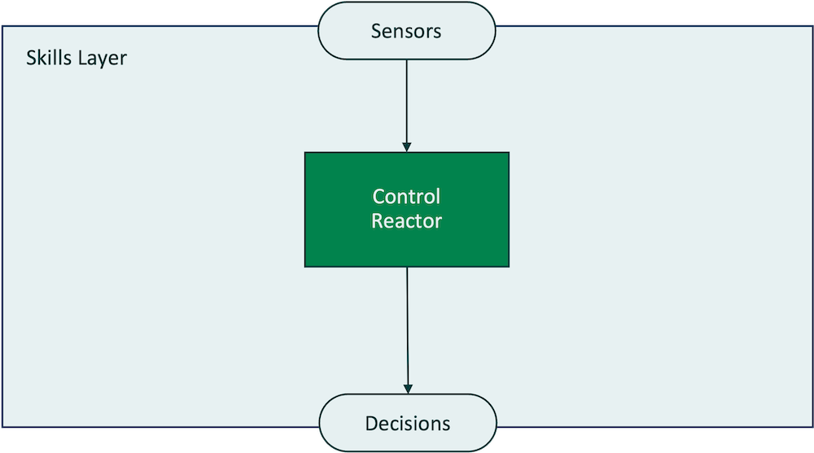
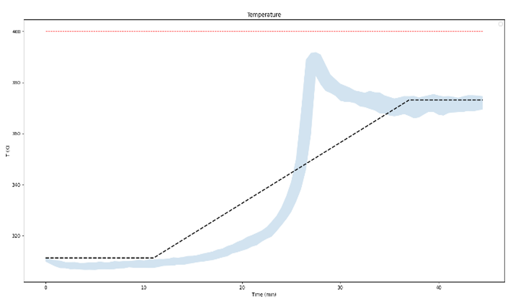
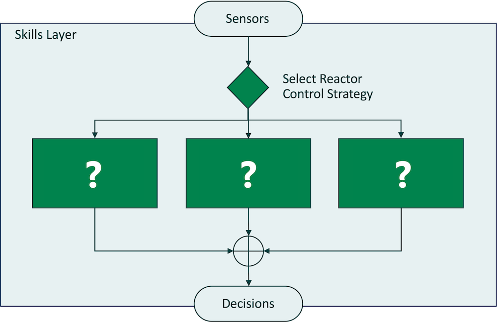
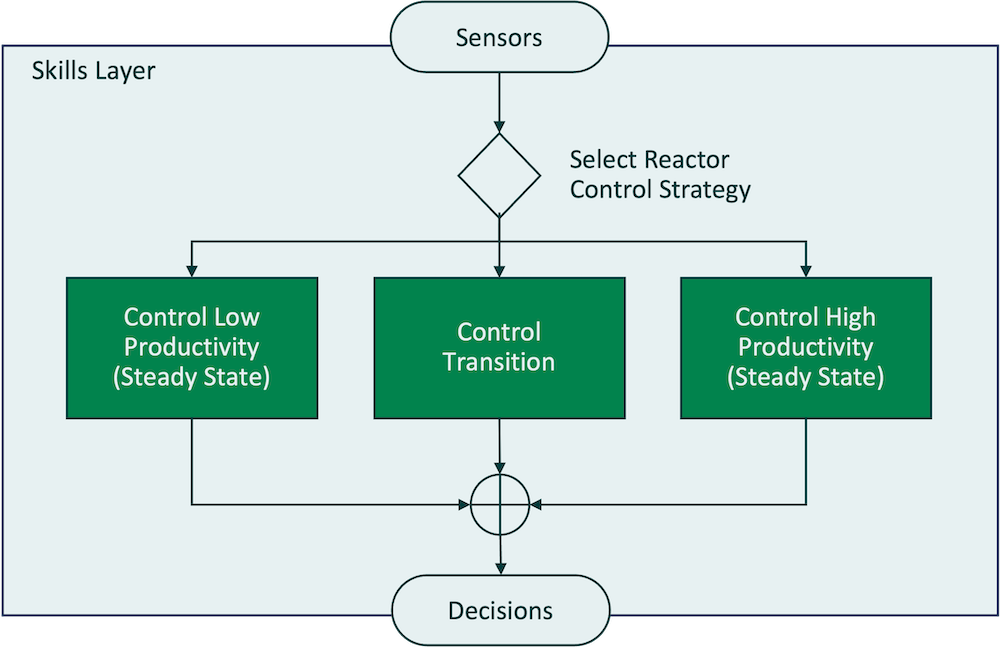
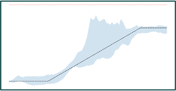

# Machine Teaching Tutorial
Build an Intelligent Autonomous Agent to Control an Industrial Mixer

## About This Tutorial
You can use Composabl to build powerful [autonomous intelligent agents](## "definition") that solve real problems and beat industrial benchmarks and other AI solutions. This tutorial will teach you how to design and build these agents using the [Machine Teaching](## "definition") methodology and the Composabl platform.

### Before You Start
To be ready for this tutorial, you should have already completed the [Try Tutorial](/1_try/), including:

- Setting up your GitHub codespace environment for Composabl
- Receiving and entering your Composabl license key
- Building your first agent with a step by step tutorial

If you have completed those steps, you are ready to learn how to design and build agents for yourself.

### In This Tutorial
This tutorial is built around a case study of an industrial mixer. Through this case study, you will learn how to design agents using modular building blocks, compare the performance of agents built with different design patterns, and then practice building, training, and operating agents in the Composabl platform.

At the end of this tutorial, you will be able to:

1. Describe why different agent designs perform differently for this problem
2.	Visually identify strategy pattern and plan-execute pattern
3.	Explain what kind of tasks strategy versus plan-execute are good for  (importance of different scenarios)
4.	Articulate differences between strategy and plan-execute pattern
5.	Write Python SDK code that defines the agent structure of a strategy pattern or a plan-execute pattern respectively
6.	Operate a trained agent
7.	Continue training a partially trained agent

### Modules

This two-hour training is divided into modules.

1. Machine Teaching Foundations (10 minutes)

    In this module, you will learn fundamentals of the machine teaching methodology. At the end of this module, you will be able to:
    - Define machine teaching
    - Explain when machine teaching is useful
    - List the three steps for designing agents with machine teaching

2. Industrial Mixer Case Study Agents and Benchmarks (20 minutes)

    In this module, you will learn about the industrial mixer use case and review the design and performance of 5 different agents. At the end of this module, you will be able to:
    - Explain the parts of an intelligent agent
    - Explain why different agent designs result in different performance

3. Build the Strategy Pattern Agent (30 minutes)

    In this module, you will build an agent using the stragegy design pattern. At the end of this module, you will be able to:
    - Explain the strategy pattern for agent design and how it addresses the needs of a use case
    - Write Python SDK code that defines the agent structure of a strategy pattern

4. Train and Operate Your Agent (30 minutes)

    In this module, you will train and operate the strategy pattern agent you just built. You will learn how to ADD MORE MORE

    - Train an agent
    - Analyze agent performance based on training data
    - Operate a trained agent
    - Continue training a partially trained agent

5. Design Patterns (30 minutes)

    In this module, you will learn about additional design patterns for intelligent agents and compare their performance to the strategy pattern.

    - Explain the plan-execute pattern for agent design and how it addresses the needs of a use case
    - Explain the use of perceptors and how they contribute to agent performance
    - Make nuanced comparisons of agent performance to select the best agent design for a use case

## Module 1: Machine Teaching Fundamentals

### What Is Machine Teaching?

Machine teaching is the methodology for designing and building [autonomous intelligent agents](## "definition"), decision-making AI that improves equipment and process control by sensing and responding in real time with more human-like decision-making.

Autonomous intelligent agents are more powerful and reliable than chatbots or other AI technology built on large language models. They are "industrial strength" - made for decision-making in high-value and high-risk processes. Compared to both traditional automation and other types of AI, they are more effective at meeting business goals, more compute efficient, and safer and more explainable.

### When Is Machine Teaching Needed?
The unique structure of agents created with Machine Teaching allows them to succeed in situations where traditional automation fails - when humans need to step in and take over because the situation is too nuanced, fuzzy, or dynamic for existing control systems to handle effectively.

#### How Machines Make Decisions

One of the strengths of Machine Teaching is that you can use any control technology within an intelligent autonomous agent. There are four major types of decision-making technologies that may be used in Machine Teaching agents.

1. **Technologies that calcuate decisions**: Mathematical modeling of decisions, such as in systems like [PID or MPC controllers](## "definition")
2. **Technologies that search decision options**: Looking up options and choosing according to pre-set criteria, such as in [optimization algorithms](## "definition")
3. **Technologies that use past experience**: Applying a system of rules determined through human practice, such as in [expert systems](## "definition")

These first three options are all widely used in traditional automation. They are each successful in situations that are well suited to their capabilities, but all fall short when conditions are too fuzzy or when the decision-making needs are too complex. That's when humans need to step in and take over the decision-making.

The fourth decision-making method is the AI innovation that can take agents to the next level.

4. **Technologies that learn decisions**:  Using AI technology, especially [deep reinforcement learning (DRL)](## "definition"), agents can develop human-like *skill* at making certain decisions by practicing in simulation, storing the results of their practice, and getting better and better over time at completing a task.

#### The Superpowers of Autonomous AI Agents

As intelligent autonomous agents practice in simulation and get better at performing skills, they develop human-like characteristics that make them effective at the most challenging tasks in industrial processes. These characteristics are the superpowers of autonomous AI agents.

- **Perception** | Autonomous intelligent agents can take in and draw useful conclusions from information in their surroundings. For example, EXAMPLE.

- **Strategy** | Autonomous intelligent agents can apply different decision-making skills in different situations based on what approach is most effective for the conditions. For example, EXAMPLE.

- **Deduction** | Autonomous intelligent agents can use information they have to draw correct conclusions about information they can't access directly. For example, EXAMPLE.

- **Learning** | Autonomous intelligent agents can store conclusions past experiences and build on them to get better at a task. For example, EXAMPLE.

- **Planning** | Autonomous intelligent agents can plan ahead, taking actions that don't have immediate payoff but are necessary for future success. For example, EXAMPLE.


#### How Machine Teaching Is Different

Machine teaching accesses these superpowers by separating tasks into modular skills. Rather than having an AI learn a task all at once, machine teaching breaks the task down and lets the agent practice each learned skill individually, using only the simulation data that is relevant to what it needs to do.

For instance, an agent controlling a drone doesn't need to practice the "Take off" skill in weather conditions in which it wouldn't be cleared to fly. But it does need to practice flying and landing in those conditions, since the weather could change during a flight.

The heart of Machine Teaching is three steps:

1. Identify skills for the agent (break the process down into separate skills)
2. Orchestrate the skills together (decide the relationships and sequence of the skills)
3. Assign the right technology to each skill (determine whether each skill should be learned with DRL or programmed with a controller or optimizer)

The next modules of this tutorial will show you how to apply these steps with an example.


***
#### Check Your Understanding

1. Question

    <details>
    <summary>Check Answer </summary>
    This is a use case for machine teaching because there is a need to balance two competing goals.
    </details>
***

## Module 2: Agent Design and Performance

### The Industrial Mixer Case Study



#### The Use Case
An industrial mixer manufactures chemical products by stirring raw materials together inside a tank. As the reagents are mixed together, a chemical reaction occurs that creates the end product.

The chemical reaction also produces heat. The hotter the tank is allowed to get, the more efficiently it produces the product, leaving less wasted reagent behind.

But if the liquid in the tank gets too hot, it can cross a thershold known as "thermal runaway" and create conditions where the tank will catch fire or explode.



#### Two Competing Goals

As in all Machine Teaching use cases, the "fuzziness" or nuance in this process can be summarized in the form of two separate goals that must be balanced against each other:

1. Produce as much product as possible
2. Eliminate the risk of thermal runaway

The key to balancing these goals is maintaining the right temperature in the tank throughout the reaction, so that it's hot enough to be efficient but cool enough that the thermal runaway threshold is never crossed.

#### Controlling the Temperature in the Tank

This use case has only one control variable. Your agent controls the termperature in the tank by adjusting the temperature of the mixture using a “jacket” filled with coolant.



If the chemicals get too hot and approach thermal runaway, the coolant temperature can be decreased to bring down the temperature in the tank – but the conversion rate will also decrease.

#### Three Different Phases with Different Control Needs

One of the reasons this use case is complex is that it occurs in three different phases.

1. It starts in a steady state with low temperature and low productivity
2. It goes through a transition period when the temperature can change quickly and unpredictably
3. It ends in a steady state of high but consistent temperature and high productivity

The transition phase is the most unpredictable and challenging to control, with the highest risk of thermal runaway.

[More details of the use case](a)

***
#### Check Your Understanding

1. Why is this problem a good use case for machine teaching?

    <details>
    <summary>Check answer </summary>
    This is a good use case for machine teaching because there is a need to balance two competing goals.
    </details>
</br>

2. What part of the process does the intelligent agent control?

    <details>
    <summary>Check answer </summary>
    Cooling jacket.
    </details>

</br>

3. Why are the phases of the reaction important to agent design?

    <details>
    <summary>Check answer </summary>
    This is a good use case for machine teaching because there is a need to balance two competing goals.
    </details>
***

### Agent Designs

The design of an agent determines its performance. In this section, we will look at five different agent designs and compare how well they control the reaction to balance the competing goals of maximizing throughput while keeping the temperature at a safe level.

#### Agent 1: Single Skill - Linear Model Predictive Control

The first agent design is the current automation solution, a linear MPC controller. As the current solution, this agent performance is the benchmark for the other designs.

The image below shows an MPC controller represented in the visual system of agent designs. The agent takes in [sensor](## "definition") information about the temperature in the tank and the concentrations of the chemicals. It passs that information to the [skills layer](## "definition") of the agent. The skills layer contains a single programmed skill: control reactor. This skill uses a mathematical model to determine the desired temperature set point for the tank. It also determines the control actions to take to achieve that temperature using the cooling jacket, and outputs those actions as decisions.



In simulation, this agent's conversion rate was 82%. That means that 82% of the reagents were turned into product, with 18% waste. As you will see when you build this agent later in the tutorial, Composabl provides visualizations of agent performance. The image below shows how the single-skill MPC agent's temperature control performed in simulation.

><br>
>
>**How to read this graph**: This graph shows the performance of the agent through the phases of the process. The x axis represents time, and the y axis shows temperature. The red line is the temperature at which thermal runaway occurs – so we want the agent to keep the temperature well below that point.
>
>The black line is the benchmark – the goal temperature if the reaction is being controlled as well as possible. And the blue area shows the actual temperature as controlled by the agent, over the course of 100 different runs through the simulation. Not every run is the same, so at each point along the x axis, the blue area represents all of the different temperatures from the 100 runs.
>
>
>

You can see from this graph that the MPC agent doesn’t perform very well. It does a good job at the start, in the first steady state. But then once it hits the challenging transition, it hits thermal runaway almost immediately.

When an MPC controller is used to control this process in the real world, a human operator needs to step in and take over control before the automated system lets the temperature cross the thermal runaway threshold.

#### Analyzing Agent Performance: Agent 1

Why did this agent perform the way it did? Like all technologies, model predictive control has a “personality,” a unique set of strengths and weaknesses. Like most math-based control systsems, MPC is a rule follower. It works well in situations governed by mathematical relationships that are straightforward and linear.

As you can see from the graph, MPC works well in the straightforward and linear first phase of the reaction, when the problem is predictable. The agent performance is very close to the benchmark.

However, as the transition phase begins, the agent’s performance starts to fail. Its performance becomes dangerously inconsistent, potentially allowing the temperature to exceed the thermal runaway checkpoint at nearly every point in the reaction.

***
#### Check Your Understanding

1. What is the "skill" in the single-skill MPC agent?

    <details>
    <summary>Check answer </summary>
   The skill is an MPC controller that uses a mathematical model to d
    </details>
</br>

2. What happens between 5 and 10 minutes on the agent performance graph?

    <details>
    <summary>Check answer </summary>
   The reaction enters into the transition phase, when the relationships between the chemical concentrations and temperature fluctuate in non-linear ways. In some of the training runs, the agent reaches thermal runaway at this point in the reaction.
    </details>
***
#### Explore Agent 1

Want to go more in depth into Agent 1?  [Explore the agent files](/2_learn/chemical_process_control/agents/deep_reinforcement_learning/) to:

- View the agent design in the SDK
- See what [a programmed skill for an MPC controller](/2_learn/chemical_process_control/agents/model_predictive_control_benchmark/controller.py) looks like
- Try training the agent in your Composabl codespace
- Copy the code to practice building the agent youself.

### Agent 2: Single Skill - Deep Reinforcement Learning

The second agent is also a single-skill agent, but instead of an MPC controller, the single skill that is being used to control the entire reaction is a learned skill trained with deep reinforcement learning.

As with the MPC agent, the sensors take information into the agent, and then that information is passed to a single skill whose job is to control the reaction. But this time, the skill is not making decisions based on math. Instead, it's using AI's unique capability to learn through practice. The DRL skill has been given parameters that reward for how well its results balance the competing goals, and then used simulation to discover and remember the best way to consisently achieve the reward.



#### Analyzing Agent Performance - Agent 2

In simulation, the DRL agent had a 90% conversion rate. Here we can see its performance.



Compared to the MPC agent, this result is much better. It stays within the safety threshold every time, and it also controls the steady states very well, staying right on the benchmark line.

But during the transition, the DRL agent goes off the benchmark line quite a bit. It doesn't notice right away when the transition phase begins, staying too long in the lower region of the graph, and then overcorrecting.

Deep reinforcement learning’s “personality” is almost the opposite of MPC’s. Where MPC is a rule follower, DRL works by experimentation, teaching itself how to get results by exploring every possible way to tackle a problem. It has no prior knowledge or understanding of a situation and relies entirely on trial and error. That means that it is potentially well suited to complex processes – like the transition phase - that can’t easily be represented mathematically. On the graph, you can see DRL’s characteristic pattern of wild experimentation, as the agent tries many different approaches to the transition on different runs.

The DRL agent’s skills do better than MPC but still leaves some room for improvement.

***
#### Check Your Understanding
1. What is the difference between Agent 1 and Agent 2?

    <details>
    <summary>Check answer</summary>
   The skill is an MPC controller that uses a mathematical model to d
    </details>
</br>

2. The designs you just looked at are autonomous intelligent agents, but they don't reflect the complete Machine Teaching methodology, because they don't use all three steps for designing agents with Machine Teaching.
    What are the three steps?
    <details>
    <summary>Check answer</summary>
    1. Divide the process into skills
    2. Orchestrate skills together
    3. Choose the right technology for each skill
    </details>
    </br>

    Which step is missing?

    <details>
    <summary>Check answer </summary>
    Orchestrate skills together is missing, since you can't orchestrate skills in a single-skill agent. But without orchestration, you miss out on a lot of the power of machine teaching to use modularity to drive results.
    </details>
***

#### Explore Agent 2

Want to go more in depth into Agent 2? [Explore the agent files](/2_learn/chemical_process_control/agents/deep_reinforcement_learning/) to:

- View the code in the SDK
- See [what a teacher looks like](/2_learn/chemical_process_control/agents/deep_reinforcement_learning/teacher.py) for a learned skill for this problem
- Try training the agent in your Composabl codespace
- Copy the code to practice building the agent youself

### Agent 3: Multi-Skill Agent - Strategy Pattern

Multi-skill agents are where you can truly leverage the power of machine teaching. Orchestrating separate, modular skills  together is what allows Machine Teaching to get results that vastly improve performance, compute efficiency, and explanability compared to other types of automation.

Most successful automous intelligent agents are structured using one of only a few [design patterns](## "Common agent structure known to successfully addresses one or more challenging phenomena"). Knowing these patterns can greatly accelerate your ability to design agents quickly and successfully for your own use cases.

Agent 3 uses the [strategy pattern](## "definition"). The strategy pattern works by dividing the process into [scenarios](## "Scenarios are situations where your agent needs to behave differently to succeed"), conditions with specific characteristics in which different decision-making skills or strategies should be used. The agent then uses a special skill called a [selector](## "definition") that is [programmed](## "A programmed skill uses a mathematical model or algorithm to make decisions") or [trained](## "A trained or learned skill uses deep reinforcement learning to make decisions by applying the learning it acquired and stored by practicing in simulation") to distinguish between the different scenarios. Depending on the conditions, the agent will pass control to one of the skills, and it will output the action. The strategy pattern is useful for problems that are challenging because they have variable conditions.

***
Think about the industrial mixer use case. How would you divide the process into different scenarios?
    <details>
    <summary>**Check answer** </summary>
    The industrial mixer problem divides naturally into three different scenarios, one for each phase of the process: the initial low-productivity steady state, the transition, and the final high-productivity steady state.
    </details>
****

The image below shows a strategy pattern agent with the skills missing. Just as in the other designs, the sensor layer takes in the information about the condition in the tank. Then it passes this information to a selector. The selector executes the appropriate strategy by assigning control to the appropriate skill. This is the [orchestration](## "definition") of the skills.


***
What skill would you assign to each of the three scenarios?
    <details>
    <summary>**Check answer** </summary>
    It's usually a good idea to name skills in a way that clearly communicates the scenario and the task. In this case, we are naming the three skills **Start Reaction**, **Navigate Transition**, and **Produce Product**.
    </details>
***


What about assigning the right technology to the skills? In this agent, all of the skills, including the selector, are learned with deep reinforcement learning. But unlike the single skill DRL agent, the skills practice separately, each with simulation data specific to its own phase of the process.



***
#### Check Your Understanding

1. Agents 2 and 3 use the same technology, deep reinforcement learning. How would you expect their performance to compare, and why?

    <details>
    <summary>Check answer </summary>
   Answer
    </details>
***


## Module 3: Build the Strategy Pattern Agent

Now that you are familiar with the strategy pattern agent design, you are going to build the agent, train it, and then evaluate its performance and compare it to the single-skill agent designs.

Inside your tutorial folder, you will find a starter kit of agent files.

- ```agent.py``` |
The [agent](## "definition") file organizes all the code for your agent, and is where you will add all the components you develop.

- ```scenarios.py``` | The [scenarios](## "different situations where the agent needs to perform differently to succeed") file identifies the sensor values that define each scenario.

- ```teacher. py``` | The [teacher](## "definition") file contains parameters for how each skill will practice in simulation to get better at the task.

- ```config.py``` | The [config](## "definition") file contains the information that tells the agent how to run, including the Composabl license key and the compute enviornment.

- ```sensors.py``` | The [sensors](## "definition") file organizes the data provided by the simulator or the real system.

Some of the agent has already been built for you. Because this tutorial focuses on building the capabilities of the agent that are unique to the Machine Teaching methodology, files that are not directly related to these Machine Teaching capabilites are pre-populated and complete.

The other files are partially complete, and require you to add additional code to create agent components. As you put the agent together, you will learn about the function and syntax for these agent components. You will focus on:
- **Breaking the process into separate modular skills**: Your starter kit agent only has one skill. You will add two additional action skills to complete the strategy pattern.
- **Orchestrating the skills together**: Your selector skill is already ceated, but you will create scenarios for the selector to use to determine which skill to use.
- **Selecting the right technology for each skill**: You will add the additional skills to the teacher so that they can learn with deep reinforcement learning.

This tutorial focuses on the basics. You can also refer to the [full SDK documentation]("link") for additional explanations and resources.

### Steps to Build the Agent

These are the steps you will take the complete the agent:

1. Create the scenarios for the additional skills
2. Add the additional skills in the teacher
3. Update the agent file
    - Import the new teachers
    - Import the new scenarios
    - Add new skills to the ```run_agent``` function
    - Add new skills to the agent using the ```add.skill()``` method
    - Add new skills to the selector

#### Step 1: Create Scenarios


Open ```sensors.py``` and ```scenarios.py```.

The sensors file is complete, but it is useful for reference. It lists and defines the sensor variables that the agent will use to process information.

The scenarios file tells the agent how to determine the scenario at each moment of the process. This files is where you define the specific sensor values that identify each scenario.

How do you know what these sensor values should be? This is one of the ways that Machine Teaching leverages human knowledge and expertise to make AI effective. If you are already a process expert, you will use your own data to define the scenarios. If not, you will need to interview a process expert to find out the data.

In this case, an engineer has provided the concentration and temperature values that define the different phases so that you can correctly define the scenarios.

Scenario 1: Low-productivity Steady State (ss1 in code)

- T (temperature): need to add range/values  for all or those that are needed
- Tc:
- Ca:
- Cref:
- Tref:

Scenario 2: Transition (transition in code)

- T (temperature):
- Tc:
- Ca:
- Cref:
- Tref:

Scenario 3: High-productivity Steady State (ss2 in code)

- T (temperature):
- Tc:
- Ca:
- Cref:
- Tref:

Using these sensor values and the code that is already in the file for Scenario 1, complete the code for Scenarios 2 and 3.

```Noise_percentage``` refers to NEED DEFINITION.

Save the file when you are done.

#### Step 2: Add Skills in the Teacher

Next, you will edit the teacher file to set up training for the skills in your agent.

Open ```teacher.py```.

There is only 1 teacher defined (StartReactionTeacher) and the selector CSTRTeacher.

This is to give you an idea of what the additional skills will look like that you need to create. The strategy pattern for IM agent contains 3 skills and 1 selector.

You will create the Navigate Transition and Produce Product skills.
Copy the code for StartReactionTeacher and paste it 2 times. Rename the teachers to NavigateReactionTeacher, ProduceProductTeacher. You will also need to edit the names of the self.title and self.history_path to reflect your new naming convention. See screenshot below for an example.


Save the file.

#### Step 3: Update the Agent File

Now that you have added skills to the teacher, you need to update the agent file with those skills.

Open ```agent.py```. Then update the code in five places.

1. Import the new teachers you just created (line 9). Follow the syntax for the teachers already in the code.

2. Import the new scenarios you just created (line 11). Follow the syntax for the scenarios already in the code.

3. Add the new skills, along with their scenarios and teachers, to the definition of the ```run_agent``` function (line 20). Follow the same syntax used for the ```start_reaction_skill```.

4. Add the new skills to the agent using the ```add_skill()``` method (line 36). Follow the syntax used for the ```start_reaction_skill```.

5. Add the new skills to the selector (line 40) by adding them to the bracket containing ```[start_reaction_skill]```. Separate the skills with commas.

Save your file. You are now ready to train your agent!

## Module 4: Training and Operating Your Agent

### Training Your Agent

You will train and operate your agent from the command line of your Codespace, using these steps.

1. Navigate to the correct folder by entering ```2_learn/chemical_process_control/2_hour_tutorial/strategy_pattern```.
2. Start the Composabl historian to track agent behavior. Type ```composabl historian start```.
3. Train your agent by typing ```python agent.py```.

#### Training to and from a Checkpoint

Your agent will train each skill and then save the training progress to a "checkpoint." This allows MORE INFO MORE INFO. You will see a message like this, which means MORE INFO MORE INFO:


Now we need to check the operation of the trained agent. This is done by starting another instance of the simulator locally and calling the agent_inference python file.

In VS Code open a new terminal by clicking on the drop down icon on the top right of the terminal window. It is next to the + icon. Select zsh to open a new terminal.

Type ```cd 2_learn/chemical_process_control/sim/src/``` to get to the correct location.

Type ```python main.py```. To confirm that the sim has started a message saying ```listening on [::]:1337``` should be displayed.

See screenshot for example:


Go back to the other terminal window. Check you are in the ```2_learn/chemical_process_control/2_hour_tutorial/strategy_pattern``` folder.

To run the Operate function for the previously trained agent type ```python agent_inference.py```. Successful operations will result in a message that looks like this screenshot:


In VSCode file explorer open the ```inference_figure.png``` file located in the benchmarks folder. This is the output from operation, and you can see the results of the agent's performance.

To start training the agent from a saved checkpoint ensure that you are in the main directory where the agent is located.

Change the agent.py file training iterations (around line 44) from 2 to 20. Save the agent file.

Run ```python agent.py``` to start training again.

#### Analyzing Agent Performance - Agent 3

Look at the training results from your agent. How did it perform compared to Agents 1 and 2?

The strategy-pattern agent had 93% conversion and 0% risk of thermal runaway. As you can see from the results, it has better performance in terms of productivity and temperature control that the single-skill DRL agent.




## Module 5: Design Patterns for Agents

You have already learned about the strategy pattern and how it addresses the needs of the use case. In this module, you will about an additional element that can be added to designs - a perception layer - and a different design pattern - the plan-execute pattern. We will compare results for five different designs that use the different patterns.

### Agent 4: Strategy Pattern with Perception

A "perception layer" is an optional design element that can be used to enhance agent performance. [Perceptors](## "definition") come between sensors and skills. They take information from the sensors and process it in some way to make it more useful.


Perceptors commonly use [machine learning](## "definition") models, which are especially skilled at pattern recognition and perception. Using machine learning, perceptors can report not just sensor variable values but predictions about what is likely to happen.

In this example, a preceptor  uses machine learning to predict thermal runaway. The perception layer in this design checks the sensor data for conditions that might indicate an elevated risk of thermal runaway, and then passes that information to the selector along with the rest of the sensor data. This helps the agent ensure that thermal runaway is never reached.

### Agent 5: Multi-Skill Agent - Plan-Execute Pattern

There are many ways to combine technologies to create an intelligent agent, and sometimes two technologies that don’t perform well individually can be very successful when paired together.

This is a design for an agent that strategically leverages the unique capabilities of DRL and MPC to achieve better control than either technology can create alone. The agent does this by putting the two technologies together in skill group, a structure that directs the agent to use the skills in sequence in a two-part decision-making process.


In this example, the DRL skill first determines the set point – that is, it uses its powers of learning and experimentation to ascertain the desired temperature at a given moment in the reaction. It then passes this information on to the MPC skill, which uses its powers of control and execution to direct the agent on what action to take to achieve the desired temperature.

These two skills working together achieve results that are arguably as good or better as the multiple learned skills in a hierarchy. In a head-to-head comparison in the same simulation conditions, the agent with DRL and MPC in a skill group converted a lower percentage of the reagents, but also came less close to thermal runaway.

### Comparing Agent Performance

This table shows the performance of all five agents rated on MORE INFO.

The decision about which of the two highest performing agents to use could be a business decision about whether it is more important to maximize conversion, in which case the multiple learned skills agent would be a better choice, or to prioritize safety, in which case the DRL and MPC agent might be preferable.

While there may not be a clear winner between the two multi-skill agents, they both significantly outperform the single-skill agents. Multiple skills and technologies working together make the difference in creating a successful intelligent agent that can effectively control the process.
