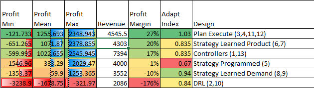
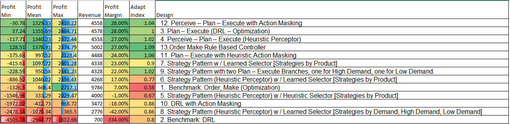

# Production Scheduling Agents

Agents

## Agents
* Optimizer Benchmark
* Deep Reinforcement Learning
* Deep Reinforcement Learning with Action Masking
* Strategy Pattern
* Strategy Pattern Programmed Selector
* Strategy Pattern with Perceptor


### Deep Reinforcement Learning


## Benchmarks

Benchmarks Grouped by Design Pattern



Benchmarks Detailed for agent




## Building Simulator

```bash
docker build -t composabl/sim-production-scheduling .
docker run --rm -it -p 1337:1337 composabl/sim-production-scheduling
```

## Running from Remote

```bash
docker pull composabl/sim-production-scheduling
docker run --rm -it -p 1337:1337 composabl/sim-production-scheduling
```

## References

https://www.composabl.com
