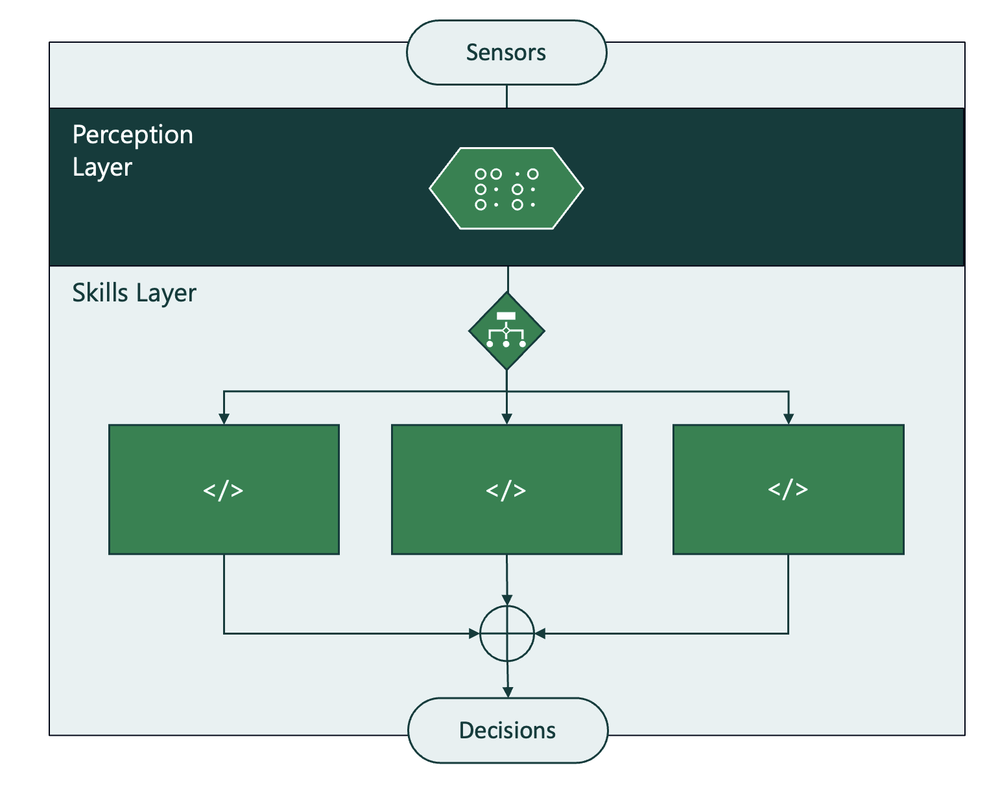
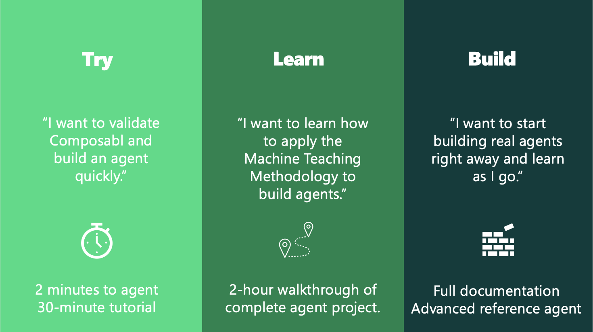

# Composabl Python SDK for Creating Industrial-Strength Intelligent Agents
Composabl is a function orchestrator for creating intelligent agents from any Python algorithm or machine learning model.

Composabl agents are modular. You can build trained machine learning models, programmed algorithms into to agents as modules or train any module in a Composabl agent with Deep Reinforcement Learning.



We provide three on-ramps to get started with Composabl:



## :motorway: Try
Use this on-ramp to quickly validate the Composabl platform, get a feel for training agents, and get started quickly with your first realistic example.

1. Set up the environment and start training your first agent in 2 minutes or less.
2. Build one of our project agents from scratch in a 30 minute tutorial.

The project for this on-ramp is to train an agent to land a starship-like rocket on its tail. Here is the directory structure:

```bash
examples.composabl.io/1_try
└── rocket_landing
    ├── agents
    └── sim
```

The agents directory contains multiple pre-configured agents that you can start training right away or modify in your tutuorial.

The sim directory contains the starship simulation that your agents will train (practice) on.

## :motorway: Learn

Follow along with the Machine Teaching methodology to build and test one of our project agents from scratch (30 minutes).

1. Create your agent shell.
2. Define sensors for your agent.
3. Add perception to your agent.
4. Construct scenarios for your agent.
5. Teach skills to your agent.
6. Train your agent.
7. Operate your agent.

The project for this on-ramp is to train an agent to control an industrial mixer. Here is the directory structure:

```bash
examples.composabl.io/2_learn
└── chemical_process_control
    ├── agents
    └── sim
```

The agents directory contains multiple pre-configured agents that you can will create in your project.

The sim directory contains the mixer simulation that your agents will train (practice) on.

## :motorway: Build

Jump right in and start building with the Composabl Python SDK. Refer back to our advanced project example, build an agent, test it and compare your performance to our benchmark agents!

Start here with the [Composabl Python SDK Documentation](<https://docs.composabl.com/> "Creating Intdustrial-Strength Intelligent Agents")

1. Set up your Composabl development environment.
2. Build agents.
3. Compare agent performance to the benchmarks.

The reference project for this on-ramp is to train an agent to schedule the production for a bakery. Here is the directory structure:

```bash
examples.composabl.io/3_build
└── production_scheduling
    ├── agents
    └── sim
```

The agents directory contains multiple pre-built agents that you can can reference as you build.

The sim directory contains the production scheduling  simulation that your agents will train (practice) on.
