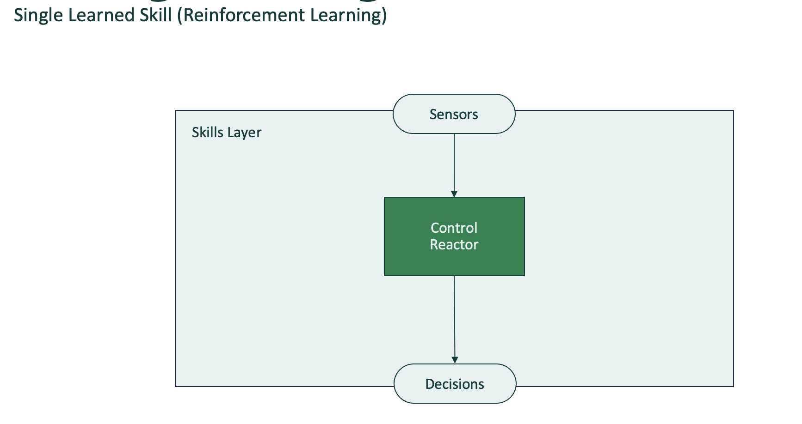
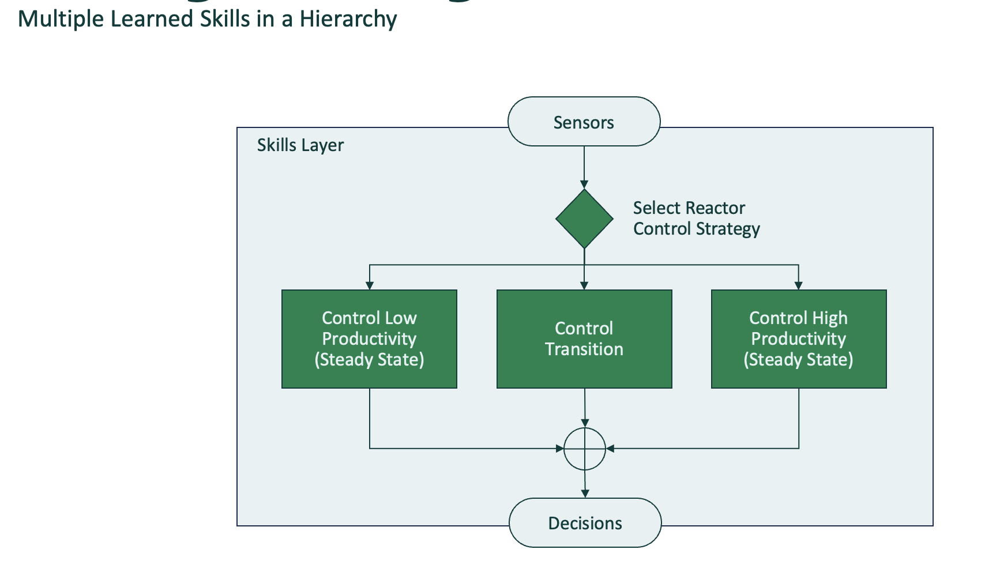
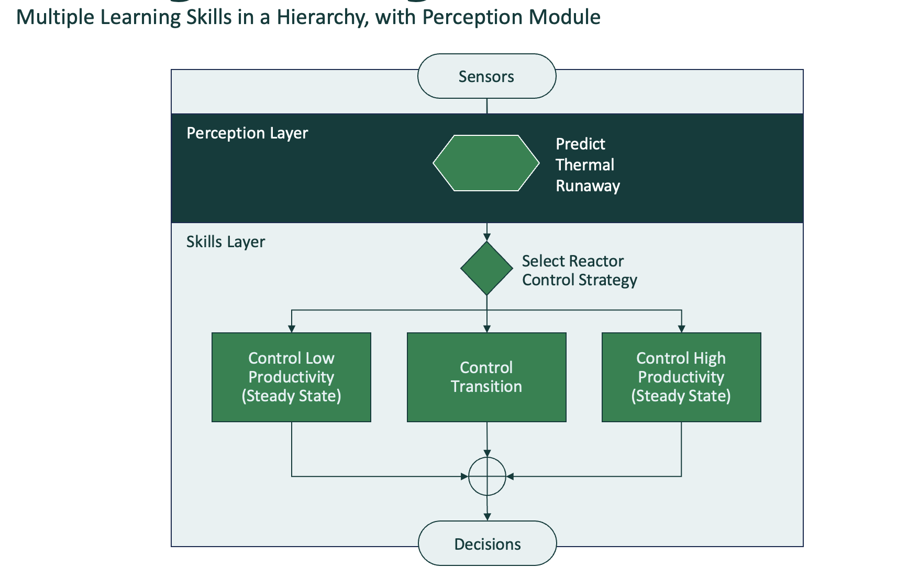
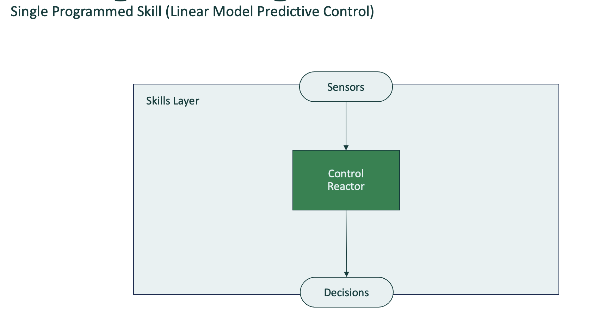
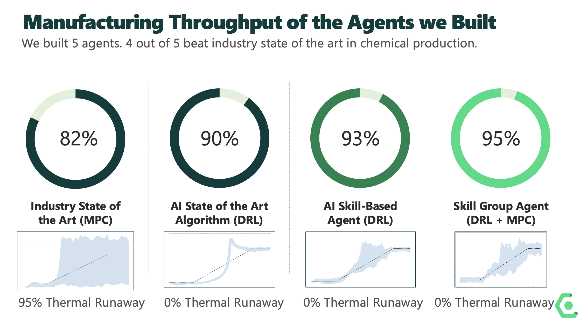

# Chemical Process Control Agents

Agents

## Agents
* Deep Reinforcement Learning
* Strategy Pattern
* Strategy Pattern Programmed Selector
* Strategy Pattern with Perceptor
* Model Predictive Control Benchmark

### Deep Reinforcement Learning
DRL vanilla Agent
Link: https://github.com/Composabl/examples.composabl.io/tree/developer_x/agents/cstr/deep_reinforcement_learning
Agent Design:



### Strategy Pattern
Multi Skill DRL Agent with Learned Selector



### Strategy Pattern Programmed Selector
Multi Skill DRL Agent with Programmed Selector

### Strategy Pattern with Perceptor
Multi Skill DRL Agent with Programmed Selector and Perceptor
Machine Learning Constraint



## Model Predictive Control Benchmark



## Benchmarks



## Building Simulator

```bash
docker build -t composabl/sim-cstr .
docker run --rm -it -p 1337:1337 composabl/sim-cstr
```

## Running from Remote

```bash
docker pull composabl/sim-cstr
docker run --rm -it -p 1337:1337 composabl/sim-cstr
```

## References

https://www.composabl.com
