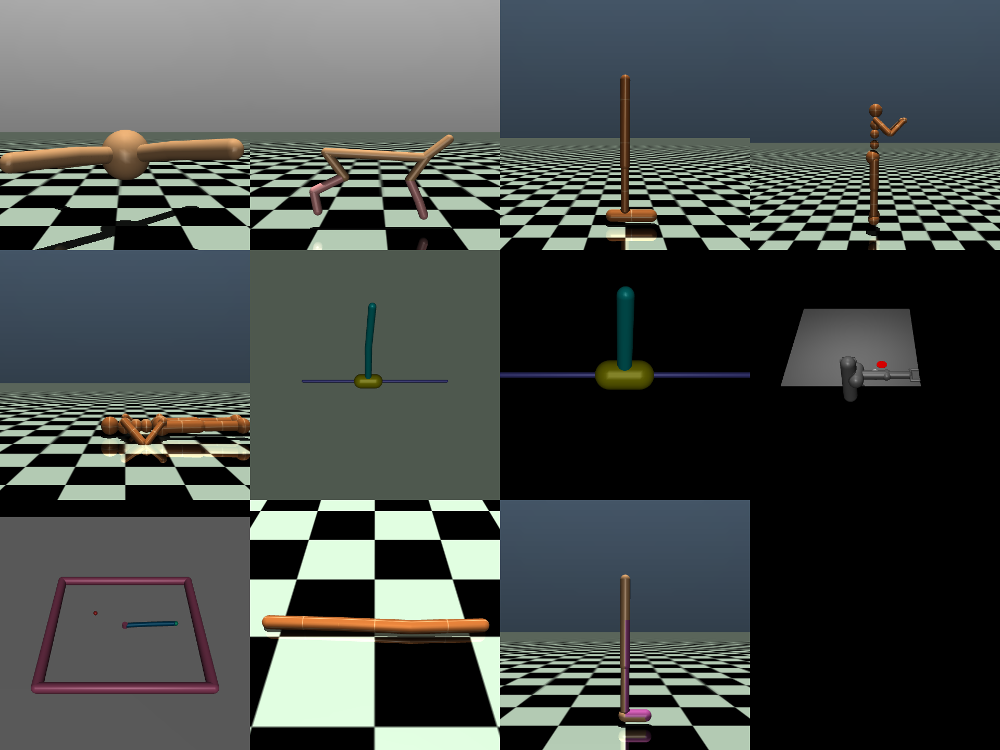

# Mujoco

The mujoco implementation is a customization from the [Gymnasium implementation](https://github.com/Farama-Foundation/Gymnasium/tree/main/gymnasium/envs/mujoco) which we do due to a couple of reasons:

- Ray does not support the latest Gymnasium version
- We want to be able to offer more simulators in the future

## Supported Environments

- ant
- half_cheetah
- hopper
- humanoid
- humanoidstandup
- inverted_double_pendulum
- inverted_pendulum
- pusher
- reacher
- swimmer
- walker2d

## Demo

A demo is situated under `src/demo.py` which renders all the environments as grid. To run this, simply execute:

```bash
# Local
python src/main.py
# Docker
docker run -p 1337:1337 composabl/sim-mujoco:latest

# Render the grid
python src/demo.py
```


